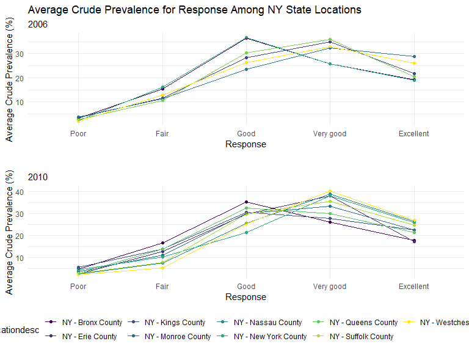

Homework 3
================
Julia Thompson
10/14/2019

## Problem 1

Load the data:

``` r
data("instacart")
```

The goal is to do some exploration of this dataset. To that end, write a
short description of the dataset, noting the size and structure of the
data, describing some key variables, and giving illstrative examples of
observations.

``` r
# Look at a random person's order info for an illustrative example
set.seed(5)
instacart_sample = instacart %>% 
  filter(user_id == sample(pull(instacart, user_id), 1)) 
```

The instacart dataset contains detailed information from online grocery
orders from 2017. It contains 1384617 observations and 15 variables. The
dataset is organized by order. Within each order, there is one row for
each item purchased, and these items have an ID and description given by
*product\_id* and *product\_name*. Each customer and order have a unique
ID, represented by the variables *user\_id* and *order\_id*. The dataset
also contai ns IDs and names for each aisle and department from which
every item came. There are 131209 distinct orders, made by 131209
different customers. Therefore, this dataset contains one order per
customer. There is not a case of the same customer havind multiple
orders here.

For example, we can look at the order for the customer with *user\_id*
77951. That customer ordered 7 items, including “Ancient Grain Original
Granola.” Customer 77951 had ordered 6 of the 7 items previously.

How many aisles are there, and which aisles are the most items ordered
from?

``` r
# get number of unique aisles
n_distinct(pull(instacart, aisle_id))
```

    ## [1] 134

``` r
# sort this, and then show the top 3
top_aisles = 
  instacart %>% 
  count(aisle) %>% 
  arrange(desc(n)) %>% 
  top_n(3, n)

knitr::kable(top_aisles)
```

| aisle                      |      n |
| :------------------------- | -----: |
| fresh vegetables           | 150609 |
| fresh fruits               | 150473 |
| packaged vegetables fruits |  78493 |

Make a plot that shows the number of items ordered in each aisle,
limiting this to aisles with more than 10000 items ordered. Arrange
aisles sensibly, and organize your plot so others can read it.

``` r
aisles_over_10k = 
  instacart %>% 
  count(aisle) %>% 
  filter(n > 10000) %>% 
  arrange(desc(n))

ggplot(aisles_over_10k, aes(x = reorder(aisle, -n), y = n)) +
  geom_bar(stat = "identity") +
  theme(axis.text.x = element_text(angle = 45, vjust = 1, hjust = 1)) +
  labs(
    title = "Number of Items Ordered in Each Aisle",
    x = "Aisle",
    y = "Number of Items",
    caption = "Number of items ordered in each aisle with more than 10,000 items ordered"
  )
```


Make a table showing the three most popular items in each of the aisles
“baking ingredients”, “dog food care”, and “packaged vegetables
fruits”. Include the number of times each item is ordered in your
table.

``` r
fav_items = instacart %>% 
  filter(aisle == c("baking ingredients","dog food care","packaged vegetables fruits")) %>% 
  group_by(aisle, product_name) %>% 
  summarize(
    n = n()
  ) %>% 
  top_n(3, n) %>% 
  arrange(aisle, n)

knitr::kable(fav_items)
```

| aisle                      | product\_name                                   |    n |
| :------------------------- | :---------------------------------------------- | ---: |
| baking ingredients         | Organic Vanilla Extract                         |  122 |
| baking ingredients         | Pure Baking Soda                                |  140 |
| baking ingredients         | Light Brown Sugar                               |  157 |
| dog food care              | Original Dry Dog                                |    9 |
| dog food care              | Organix Chicken & Brown Rice Recipe             |   13 |
| dog food care              | Organix Grain Free Chicken & Vegetable Dog Food |   14 |
| packaged vegetables fruits | Organic Blueberries                             | 1692 |
| packaged vegetables fruits | Organic Raspberries                             | 1920 |
| packaged vegetables fruits | Organic Baby Spinach                            | 3324 |

Make a table showing the mean hour of the day at which Pink Lady Apples
and Coffee Ice Cream are ordered on each day of the week; format this
table for human readers (i.e. produce a 2 x 7 table).

``` r
hr_of_day = instacart %>% 
  filter(product_name == c("Pink Lady Apples", "Coffee Ice Cream")) %>% 
  group_by(product_name, order_dow) %>% 
  summarize(
    mean_hr = mean(order_hour_of_day)
  ) %>% 
  pivot_wider(
    names_from = order_dow,
    values_from = mean_hr
  ) %>% 
  rename(
    Sunday    = `0`, 
    Monday    = `1`, 
    Tuesday   = `2`, 
    Wednesday = `3`, 
    Thursday  = `4`, 
    Friday    = `5`, 
    Saturday  = `6`
  )

knitr::kable(hr_of_day)
```

| product\_name    |   Sunday |   Monday |  Tuesday | Wednesday | Thursday |   Friday | Saturday |
| :--------------- | -------: | -------: | -------: | --------: | -------: | -------: | -------: |
| Coffee Ice Cream | 13.22222 | 15.00000 | 15.33333 |   15.4000 | 15.16667 | 10.33333 | 12.35294 |
| Pink Lady Apples | 12.25000 | 11.67857 | 12.00000 |   13.9375 | 11.90909 | 13.86957 | 11.55556 |

## Problem 2

``` r
data("brfss_smart2010")
```

First, do some data cleaning:

format the data to use appropriate variable names; focus on the “Overall
Health” topic include only responses from “Excellent” to “Poor” organize
responses as a factor taking levels ordered from “Poor” to “Excellent”

``` r
brfss = brfss_smart2010 %>% 
  janitor::clean_names() %>% 
  filter(topic == "Overall Health") %>% 
  mutate(
    response = factor(response, levels = c("Poor", "Fair", "Good", "Very good", "Excellent"))
  ) %>% 
  rename(state = locationabbr)
```

In 2002, which states were observed at 7 or more locations? What about
in 2010?

``` r
brfss_2002 = brfss %>% 
  filter(year == 2002) %>% 
  group_by(state) %>% 
  summarize(
    n_dist = n_distinct(locationdesc)
  ) %>% 
  filter(n_dist >= 7)

brfss_2010 = brfss %>% 
  filter(year == 2010) %>% 
  group_by(state) %>% 
  summarize(
    n_dist = n_distinct(locationdesc)
  ) %>% 
  filter(n_dist >= 7)

knitr::kable(brfss_2002)
```

| state | n\_dist |
| :---- | ------: |
| CT    |       7 |
| FL    |       7 |
| MA    |       8 |
| NC    |       7 |
| NJ    |       8 |
| PA    |      10 |

``` r
knitr::kable(brfss_2010)
```

| state | n\_dist |
| :---- | ------: |
| CA    |      12 |
| CO    |       7 |
| FL    |      41 |
| MA    |       9 |
| MD    |      12 |
| NC    |      12 |
| NE    |      10 |
| NJ    |      19 |
| NY    |       9 |
| OH    |       8 |
| PA    |       7 |
| SC    |       7 |
| TX    |      16 |
| WA    |      10 |

Construct a dataset that is limited to Excellent responses, and
contains, year, state, and a variable that averages the data\_value
across locations within a state. Make a “spaghetti” plot of this average
value over time within a state (that is, make a plot showing a line for
each state across years – the geom\_line geometry and group aesthetic
will help).

``` r
brfss_excellent = brfss %>% 
  filter(response == "Excellent") %>% 
  group_by(state, year) %>% 
  summarize(
    avg_data_value = mean(data_value)
  )

spaghetti = 
  ggplot(brfss_excellent, aes(x = year, y = avg_data_value, color = state)) +
  geom_line() +
  labs(
    title = "Data Value by State from 2002 to 2010",
    x = "Year",
    y = "Average Crude Prevalence (%)"
  )

spaghetti + 
  labs(color = "State") +
  guides(col = guide_legend(ncol = 14))
```


Make a two-panel plot showing, for the years 2006, and 2010,
distribution of data\_value for responses (“Poor” to “Excellent”) among
locations in NY State.

``` r
brfss_NY_2006 = brfss %>% 
  filter(state == "NY" & year == "2006") %>% 
  group_by(locationdesc, response) %>% 
  summarize(
    avg_data_value = mean(data_value)
  )

brfss_NY_2010 = brfss %>% 
  filter(state == "NY" & year == "2010") %>% 
  group_by(locationdesc, response) %>% 
  summarize(
    avg_data_value = mean(data_value)
  )

NY_2006 = 
  ggplot(brfss_NY_2006, aes(x = response, y = avg_data_value, color = locationdesc, group = locationdesc)) +
  geom_point() +
  geom_line() +
  labs(
    title = "Average Crude Prevalence for Response Among NY State Locations",
    subtitle = "2006",
    x = "Response",
    y = "Average Crude Prevalence (%)"
  ) 

NY_2006 = 
  NY_2006 +
  theme(legend.position = "none")


NY_2010 =
  ggplot(brfss_NY_2010, aes(x = response, y = avg_data_value, color = locationdesc, group = locationdesc)) +
  geom_point() +
  geom_line() +
  labs(
    title = "",
    subtitle = "2010",
    x = "Response",
    y = "Average Crude Prevalence (%)"
  )

(NY_2006/NY_2010)
```



## Problem 3

``` r
acc_data = read_csv("./data/accel_data.csv")
```

    ## Parsed with column specification:
    ## cols(
    ##   .default = col_double(),
    ##   day = col_character()
    ## )

    ## See spec(...) for full column specifications.

Load, tidy, and otherwise wrangle the data. Your final dataset should
include all originally observed variables and values; have useful
variable names; include a weekday vs weekend variable; and encode data
with reasonable variable classes. Describe the resulting dataset
(e.g. what variables exist, how many observations, etc)

``` r
acc_data_long = acc_data %>% 
  pivot_longer(
    cols = activity.1:activity.1440,
    names_to = "activity_number",
    values_to = "activity_counts",
    names_prefix = "activity.",
  ) %>% 
  rename(
    day_of_week = day
  ) %>% 
  mutate(
    is_weekend = (day_of_week == "Saturday" | day_of_week == "Sunday")
    )
```

Traditional analyses of accelerometer data focus on the total activity
over the day. Using your tidied dataset, aggregate accross minutes to
create a total activity variable for each day, and create a table
showing these totals. Are any trends apparent?

``` r
total_act = 
  acc_data_long %>% 
  group_by(day_id) %>% 
  summarize(
    total_activity = sum(activity_counts)
  ) 

knitr::kable(total_act)
```

| day\_id | total\_activity |
| ------: | --------------: |
|       1 |       480542.62 |
|       2 |        78828.07 |
|       3 |       376254.00 |
|       4 |       631105.00 |
|       5 |       355923.64 |
|       6 |       307094.24 |
|       7 |       340115.01 |
|       8 |       568839.00 |
|       9 |       295431.00 |
|      10 |       607175.00 |
|      11 |       422018.00 |
|      12 |       474048.00 |
|      13 |       423245.00 |
|      14 |       440962.00 |
|      15 |       467420.00 |
|      16 |       685910.00 |
|      17 |       382928.00 |
|      18 |       467052.00 |
|      19 |       371230.00 |
|      20 |       381507.00 |
|      21 |       468869.00 |
|      22 |       154049.00 |
|      23 |       409450.00 |
|      24 |         1440.00 |
|      25 |       260617.00 |
|      26 |       340291.00 |
|      27 |       319568.00 |
|      28 |       434460.00 |
|      29 |       620860.00 |
|      30 |       389080.00 |
|      31 |         1440.00 |
|      32 |       138421.00 |
|      33 |       549658.00 |
|      34 |       367824.00 |
|      35 |       445366.00 |
