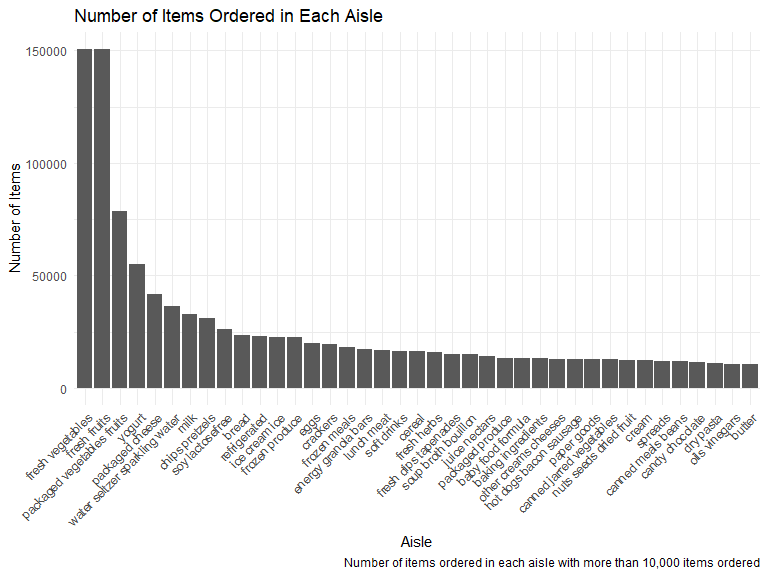
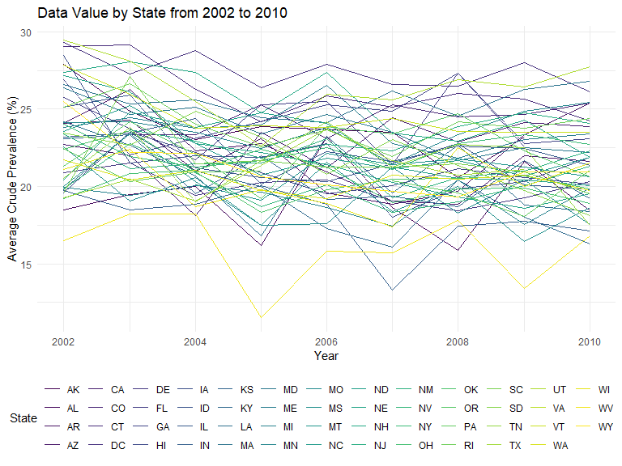
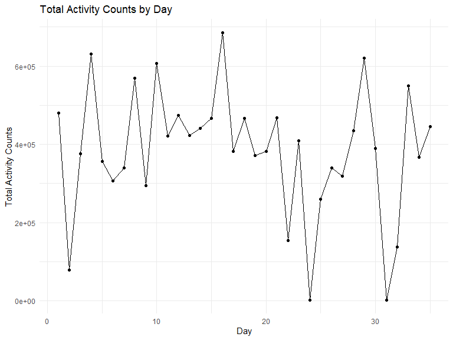
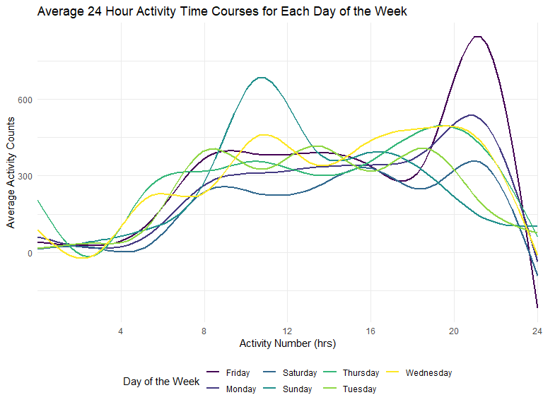

Homework 3
================
Julia Thompson
10/14/2019

## Problem 1

Pulling a random sample for an example:

``` r
data("instacart")
```

``` r
# Look at a random person's order info for an example
set.seed(5)
instacart_sample = instacart %>% 
  filter(user_id == sample(pull(instacart, user_id), 1)) 
```

The instacart dataset contains detailed information from online grocery
orders from 2017. It contains 1384617 observations and 15 variables. The
dataset is organized by order. Within each order, there is one row for
each item purchased, and these items have an ID and description given by
*product\_id* and *product\_name*. Each customer and order have a unique
ID, represented by the variables *user\_id* and *order\_id*. The dataset
also contains IDs and names for each aisle and department from which
every item came. There are 131209 distinct orders, made by 131209
different customers. Therefore, this dataset contains one order per
customer. There is not a case of the same customer havind multiple
orders here. We can look at the order for the customer with *user\_id*
77951. That customer ordered 7 items, including “Ancient Grain Original
Granola.” Customer 77951 had ordered 6 of the 7 items previously.

``` r
top_aisles = 
  instacart %>% 
  count(aisle) %>% 
  arrange(desc(n)) %>% 
  top_n(3, n)
```

There are 134 aisles, and from the below table, we see that the top 3
aisles most items are ordered from are fresh vegetables, fresh fruits,
and packaged vegetables fruits. Here, n represents the total number of
items ordered from the respective aisle.

| aisle                      |      n |
| :------------------------- | -----: |
| fresh vegetables           | 150609 |
| fresh fruits               | 150473 |
| packaged vegetables fruits |  78493 |

``` r
aisles_over_10k = 
  instacart %>% 
  count(aisle) %>% 
  filter(n > 10000) %>% 
  arrange(desc(n))

ggplot(aisles_over_10k, aes(x = reorder(aisle, -n), y = n)) +
  geom_bar(stat = "identity") +
  theme(axis.text.x = element_text(angle = 45, vjust = 1, hjust = 1)) +
  labs(
    title = "Number of Items Ordered in Each Aisle",
    x = "Aisle",
    y = "Number of Items",
    caption = "Number of items ordered in each aisle with more than 10,000 items ordered"
  )
```



The above plot shows the number of items ordered in each aisle for
aisles with more than 10,000 items ordered. We can see the same 3 items
shown in the chart: *fresh vegetables*, *fresh fruits*, and *packaged
vegetables fruits*. The majority of the aisles have less than 25,000
items ordered, with the *butter* aisle having the least (in the \>
10,000 category). I found it surprising that *water seltzer sparkling
water* ranked so high in number of items bought.

``` r
fav_items = instacart %>% 
  filter(aisle == c("baking ingredients","dog food care","packaged vegetables fruits")) %>% 
  group_by(aisle, product_name) %>% 
  summarize(
    n = n()
  ) %>% 
  top_n(3, n) %>% 
  arrange(aisle, n)
```

The below table shows the three most popular items in *baking
ingredients*, *dog food care*, and *packaged vegetables fruits*, and the
number of times each item was ordered. The *dog food care* aisle’s top 3
items were all much lower than the *baking ingredients* and *packaged
vegetables fruits*, which makes
sense.

| aisle                      | product\_name                                   |    n |
| :------------------------- | :---------------------------------------------- | ---: |
| baking ingredients         | Organic Vanilla Extract                         |  122 |
| baking ingredients         | Pure Baking Soda                                |  140 |
| baking ingredients         | Light Brown Sugar                               |  157 |
| dog food care              | Original Dry Dog                                |    9 |
| dog food care              | Organix Chicken & Brown Rice Recipe             |   13 |
| dog food care              | Organix Grain Free Chicken & Vegetable Dog Food |   14 |
| packaged vegetables fruits | Organic Blueberries                             | 1692 |
| packaged vegetables fruits | Organic Raspberries                             | 1920 |
| packaged vegetables fruits | Organic Baby Spinach                            | 3324 |

``` r
hr_of_day = instacart %>% 
  filter(product_name == c("Pink Lady Apples", "Coffee Ice Cream")) %>% 
  group_by(product_name, order_dow) %>% 
  summarize(
    mean_hr = mean(order_hour_of_day)
  ) %>% 
  pivot_wider(
    names_from = order_dow,
    values_from = mean_hr
  ) %>% 
  rename(
    Sunday    = `0`, 
    Monday    = `1`, 
    Tuesday   = `2`, 
    Wednesday = `3`, 
    Thursday  = `4`, 
    Friday    = `5`, 
    Saturday  = `6`
  )
```

The below table shows the average hour of the day at which Pink Lady
Apples and Coffee Ice Cream were ordered on each day of the week. It is
important to note that we assumed 0 corresponded to Sunday in the
dataset. We can see that people generally ordered Coffee Ice Cream a
little bit later in the day than Pink Lady Apples, other than on
Fridays.

| product\_name    | Sunday | Monday | Tuesday | Wednesday | Thursday | Friday | Saturday |
| :--------------- | -----: | -----: | ------: | --------: | -------: | -----: | -------: |
| Coffee Ice Cream |  13.22 |  15.00 |   15.33 |     15.40 |    15.17 |  10.33 |    12.35 |
| Pink Lady Apples |  12.25 |  11.68 |   12.00 |     13.94 |    11.91 |  13.87 |    11.56 |

## Problem 2

``` r
data("brfss_smart2010")

brfss = brfss_smart2010 %>% 
  janitor::clean_names() %>% 
  filter(topic == "Overall Health") %>% 
  mutate(
    response = factor(response, levels = c("Poor", "Fair", "Good", "Very good", "Excellent"))
  ) %>% 
  rename(state = locationabbr)
```

``` r
brfss_2002 = brfss %>% 
  filter(year == 2002) %>% 
  group_by(state) %>% 
  summarize(
    n_dist = n_distinct(locationdesc)
  ) %>% 
  filter(n_dist >= 7)

brfss_2010 = brfss %>% 
  filter(year == 2010) %>% 
  group_by(state) %>% 
  summarize(
    n_dist = n_distinct(locationdesc)
  ) %>% 
  filter(n_dist >= 7)
```

In 2002, we see that there were 6 states that were observed at 7 or more
locations. The below table gives the states as well as the corresponding
number of locations.

| state | n\_dist |
| :---- | ------: |
| CT    |       7 |
| FL    |       7 |
| MA    |       8 |
| NC    |       7 |
| NJ    |       8 |
| PA    |      10 |

In 2010, there were 14 states that were observed at 7 or more locations.
The below table shows the states and number of locations. We see that
the number of states observed at 7 or more locations more than doubled
between 2002 and 2010.

| state | n\_dist |
| :---- | ------: |
| CA    |      12 |
| CO    |       7 |
| FL    |      41 |
| MA    |       9 |
| MD    |      12 |
| NC    |      12 |
| NE    |      10 |
| NJ    |      19 |
| NY    |       9 |
| OH    |       8 |
| PA    |       7 |
| SC    |       7 |
| TX    |      16 |
| WA    |      10 |

Constructed a dataset that is limited to “Excellent” responses. It
contains *year*, *state*, and *avg\_data\_value*, which is a variable
that averages the *data\_value* across locations within a state.

The below spaghetti plot shows the average of crude prevalence (%) over
time within a state. For the most part, the crude prevalence is between
15% and 30%, with West Virginia having a noticable sharp decrease in
crude prevalence in 2005 and again in 2009. Indianna also had a low
crude prevalence in 2007. We also notice that DC has a high prevalence
throughout, from 2002 to 2010.

``` r
brfss_excellent = brfss %>% 
  filter(response == "Excellent") %>% 
  group_by(state, year) %>% 
  summarize(
    avg_data_value = mean(data_value)
  )

spaghetti = 
  ggplot(brfss_excellent, aes(x = year, y = avg_data_value, color = state)) +
  geom_line() +
  labs(
    title = "Data Value by State from 2002 to 2010",
    x = "Year",
    y = "Average Crude Prevalence (%)"
  )

spaghetti + 
  labs(color = "State") +
  guides(col = guide_legend(ncol = 14))
```



Below is a two-panel plot showing, for the years 2006, and 2010, the
distribution of average crude prevalence (%) for responses “Poor” to
“Excellent” among locations in NY State. We see for both 2006 and
2010, “Poor” responses had a low average crude prevalence for all of the
counties. There is a general increasing trend for “Fair” and then “Good”
responses, and then “Very good” and “Excellent” taper off. The trends
are similar for most counties, though we do see crossover, particularly
between “Good” and “Very good” for both 2006 and 2010.

``` r
brfss_NY_2006 = brfss %>% 
  filter(state == "NY" & year == "2006") %>% 
  group_by(locationdesc, response) %>% 
  summarize(
    avg_data_value = mean(data_value)
  )

brfss_NY_2010 = brfss %>% 
  filter(state == "NY" & year == "2010") %>% 
  group_by(locationdesc, response) %>% 
  summarize(
    avg_data_value = mean(data_value)
  )

NY_2006 = 
  ggplot(brfss_NY_2006, aes(x = response, y = avg_data_value, color = locationdesc, group = locationdesc)) +
  geom_point() +
  geom_line() +
  labs(
    title = "Average Crude Prevalence for Response Among NY State Locations",
    subtitle = "2006",
    x = "Response",
    y = "Average Crude Prevalence (%)"
  ) 

NY_2006 = 
  NY_2006 +
  theme(legend.position = "none")


NY_2010 =
  ggplot(brfss_NY_2010, aes(x = response, y = avg_data_value, color = locationdesc, group = locationdesc)) +
  geom_point() +
  geom_line() +
  labs(
    title = "",
    subtitle = "2010",
    x = "Response",
    y = "Average Crude Prevalence (%)"
  )

NY_2010 = 
  NY_2010 + labs(color = "County")

(NY_2006/NY_2010)
```


## Problem 3

``` r
acc_data = read_csv("./data/accel_data.csv")
```

    ## Parsed with column specification:
    ## cols(
    ##   .default = col_double(),
    ##   day = col_character()
    ## )

    ## See spec(...) for full column specifications.

``` r
acc_data_long = acc_data %>% 
  pivot_longer(
    cols = activity.1:activity.1440,
    names_to = "activity_number",
    values_to = "activity_counts",
    names_prefix = "activity.",
  ) %>% 
  rename(
    day_of_week = day
  ) %>% 
  mutate(
    is_weekend = (day_of_week == "Saturday" | day_of_week == "Sunday")
    )
```

The above dataset, *acc\_data\_long*, contains 6 variables and 50400
observations. It contains variables for week (1 to 5), day ID (1 to 35),
and day of the week (Sunday to Saturday). Activity number gives the
minute in the 24 hour period, and activity count is the actual activity
measurement. In addition, there is a variable *is\_weekend* that is
*TRUE* when the day of the week is a weekend, and *FALSE* otherwise.

``` r
total_act = 
  acc_data_long %>% 
  group_by(day_id) %>% 
  summarize(
    total_activity = sum(activity_counts)
  ) 

knitr::kable(total_act)
```

| day\_id | total\_activity |
| ------: | --------------: |
|       1 |       480542.62 |
|       2 |        78828.07 |
|       3 |       376254.00 |
|       4 |       631105.00 |
|       5 |       355923.64 |
|       6 |       307094.24 |
|       7 |       340115.01 |
|       8 |       568839.00 |
|       9 |       295431.00 |
|      10 |       607175.00 |
|      11 |       422018.00 |
|      12 |       474048.00 |
|      13 |       423245.00 |
|      14 |       440962.00 |
|      15 |       467420.00 |
|      16 |       685910.00 |
|      17 |       382928.00 |
|      18 |       467052.00 |
|      19 |       371230.00 |
|      20 |       381507.00 |
|      21 |       468869.00 |
|      22 |       154049.00 |
|      23 |       409450.00 |
|      24 |         1440.00 |
|      25 |       260617.00 |
|      26 |       340291.00 |
|      27 |       319568.00 |
|      28 |       434460.00 |
|      29 |       620860.00 |
|      30 |       389080.00 |
|      31 |         1440.00 |
|      32 |       138421.00 |
|      33 |       549658.00 |
|      34 |       367824.00 |
|      35 |       445366.00 |

``` r
# Look at trends
ggplot(total_act, aes(x = day_id, y = total_activity))+
  geom_point() +
  geom_line() +
  labs(
    title = "Total Activity Counts by Day",
    x = "Day",
    y = "Total Activity Counts"
  )
```



Aggregated across minutes to create a total activity variable for each
day, and created a table showing these totals. Created a simple graph to
make the trends easier to see. We notice that there is an oscillating
trend, in other words the activity count typically is high one day and
lower the next. Additionally, the activity counts are generally lower
after day 20 than before.

``` r
acc_by_dow = acc_data_long %>% 
  mutate(
   activity_number = as.numeric(as.character(activity_number)) 
  ) %>% 
  group_by(day_of_week, activity_number) %>% 
  summarize(
    avg_value = mean(activity_counts)
  )

plot_smooth = 
  ggplot(acc_by_dow, aes(x = activity_number, y = avg_value, color = day_of_week)) +
  geom_smooth(se=FALSE) +
  scale_x_discrete(limit = c(240,480,720,960,1200,1440), 
                   labels=c("4", "8", "12", "16", "20", "24")) +
  labs(
    title = "Average 24 Hour Activity Time Courses for Each Day of the Week",
    x = "Activity Number (hrs)",
    y = "Average Activity Counts"
  )

plot_smooth + labs(color = "Day of the Week")
```

    ## `geom_smooth()` using method = 'gam' and formula 'y ~ s(x, bs = "cs")'



Created a single-panel plot showing the average 24-hour activity time
courses for each day of the week. We can see on all days of the week
that there is little activity before 4:00, which makes sense. The
activity levels slowly climb between 4:00 and 8:00, and then are
relatively high between 8:00 and 20:00. After 20:00, they start to
decline as people go to bed for the evening. The main variants from
those trends are Sunday and Friday. People tend to have higher activity
on Sunday mornings (between 8:00 and 12:00) and Friday nights (between
18:00 and 22:00).
